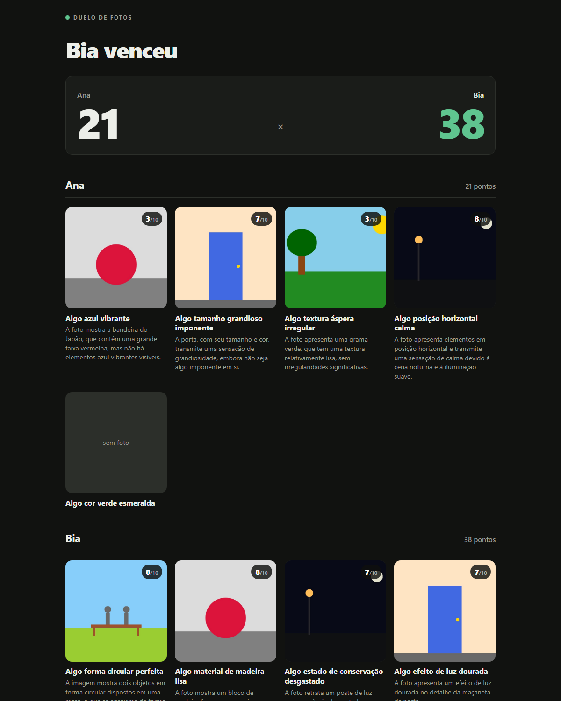
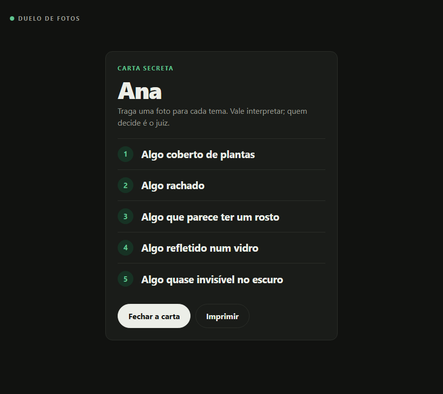

# Duelo de Fotos

A photo duel for two people, judged by a Gemma model running on your own computer.

Before you go out, Gemma hands each player five secret themes ("something rusty", "something that blinks"). Outside, your phone is only a camera. Back home, you drop the photos in, Gemma scores each one from 0 to 10 with a one-line reason, and the scoreboard tells you who won.

The screen is the short part: about a minute before the walk and a minute after. Everything in between happens outside.

Built for the [DEV Hacktoberfest 2026 challenge, week 1: "Touch Grass"](https://dev.to/challenges/hacktoberfest-week1-2026-10-05).



The photos in the screenshots are test drawings, not real pictures. The app's interface is in Brazilian Portuguese.

## How a duel goes

1. **Draw the themes.** Type the two names, say whether the walk is by day or by night, and optionally what kind of place it is. Gemma picks five themes for each player.
2. **Take your secret card.** Each player opens only their own card, takes a picture of it with the phone or prints it, and closes it.

   

3. **Go outside.** One photo per theme. Interpretation is allowed; the judge decides.
4. **Call the judge.** Back home, upload one photo per theme. A theme without a photo scores zero. Gemma looks at each photo on its own and gives a score and a reason.
5. **Argue with the judge.** It is a small model and it is sometimes confidently wrong. That is part of the game.

## Running it

You need Java 25 and [Ollama](https://ollama.com) with the `gemma3:4b` model.

```
ollama pull gemma3:4b
./mvnw spring-boot:run
```

On Windows, use `mvnw.cmd` instead of `./mvnw`. Then open http://127.0.0.1:8080.

To check that the model answers before you start, open http://127.0.0.1:8080/verificar. It returns a short JSON with the model's reply and how long it took, or a 503 if Ollama is not running.

## Privacy

- The model runs locally through Ollama. Photos are never sent to a remote service.
- The server listens on `127.0.0.1` only.
- Duels, names and photos are stored in a `duelos/` folder next to the app, one folder per duel. That folder is ignored by git.
- When a model call fails, the log records only the exception class, because the message can quote what was sent to the model.

## How it works

**Themes.** The themes come from a hand-written list of 75 in [`temas.txt`](src/main/resources/temas.txt), each tagged as day, night or any time. For each duel the app draws 24 candidates (every theme for the chosen period plus a random draw of the general ones) and asks Gemma to choose the ten that fit the walk. Any line Gemma returns that is not in the list is ignored, and if it chooses fewer than ten the app fills the rest from the candidates. No theme asks for a photo of people.

An earlier version let the model write the themes freely. They came out either too poetic to photograph or too specific to find, so the wording is now fixed and the model only chooses.

**Judging.** Each photo goes to the model in its own call, together with its theme. The model must answer with a JSON object holding a score from 0 to 10 and a short reason. An answer without both fields counts as a failure: the app tries once more and then marks the photo as "could not be judged", worth zero points.

**Photos.** JPEG or PNG, up to 20 MB each. The type is detected from the file's content, not from what the browser declares, and files are stored under names the app chooses.

**Stack.** Java 25, Spring Boot 4.1, Spring AI 2.0, Thymeleaf, Ollama with `gemma3:4b`. Retries on model calls are turned off, so a closed Ollama fails in seconds instead of hanging the page.

## Known limits

- **The judge is generous and sometimes wrong.** In a test duel most scores landed between 7 and 8, and a red ball scored 8 for the theme "something made of smooth wood" because the model saw "a block of smooth wood".
- **The kind of place barely changes the themes.** Day versus night makes a real difference; "beach" versus "square" mostly does not.
- **HEIC photos are not accepted.** iPhones need to be set to save JPEG, or the photos converted first.
- **There is no list of past duels.** You get back to a duel through its address, so keep the page open or bookmark it.
- **Testing so far used drawings**, not photos from a real walk.

## Tests

```
./mvnw test
```

The tests cover theme selection, verdict parsing, storage and page rendering. They do not call the model, so they pass with Ollama closed.

## License

[MIT](LICENSE)
